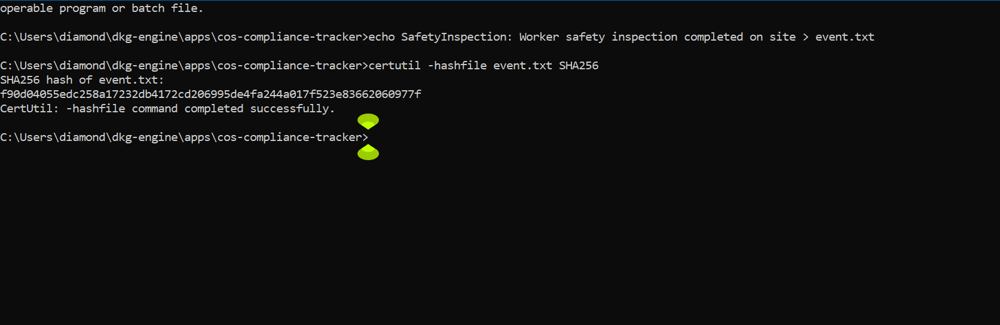
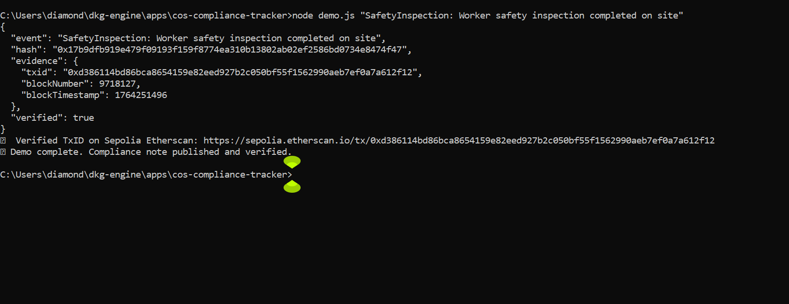
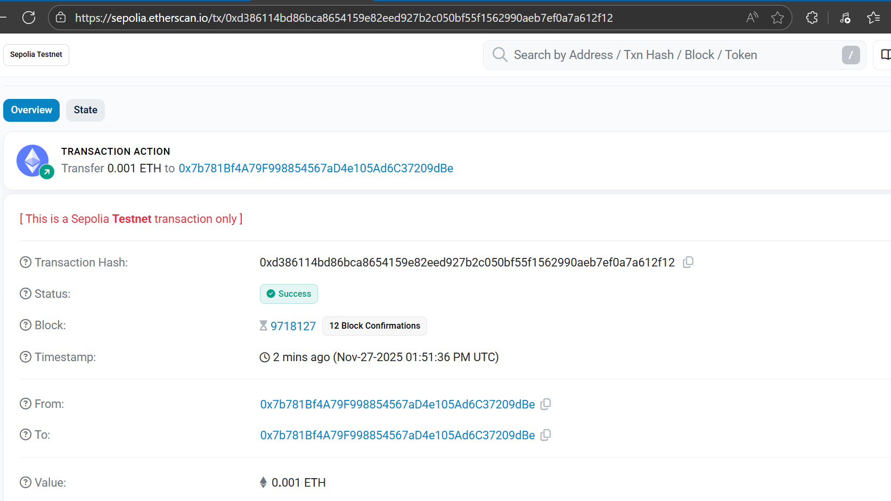
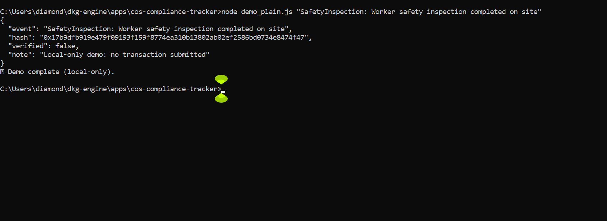
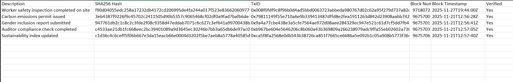

# 📸 Screenshots — COS™ Blockchain Compliance Tracker

This file serves as the **index of reproducibility screenshots** for hackathon judges.  
Each screenshot provides visual evidence of the reproducibility workflow and must match outputs from demo scripts, Etherscan verification, and audit table entries.

All screenshots are stored in:
```
apps/cos-compliance-tracker/appendix/screenshots/
```

---

## 1. Local Hash Generation


---

## 2. Blockchain Demo Transaction


---

## 3. Sepolia Etherscan Verification


---

## 4. Offline Fallback Demo


---

## 5. Audit Table Entry


---

## ✅ Judge Reminder
Judges should confirm that:
- Local hash matches the `hash` field in demo outputs  
- TxID and block details match Sepolia Etherscan verification  
- Offline fallback demo shows reproducibility without blockchain submission  
- Audit table entry corresponds to the verified transaction  
- Screenshots are consistent with `commands.md` and `judge_checklist.md`


---

